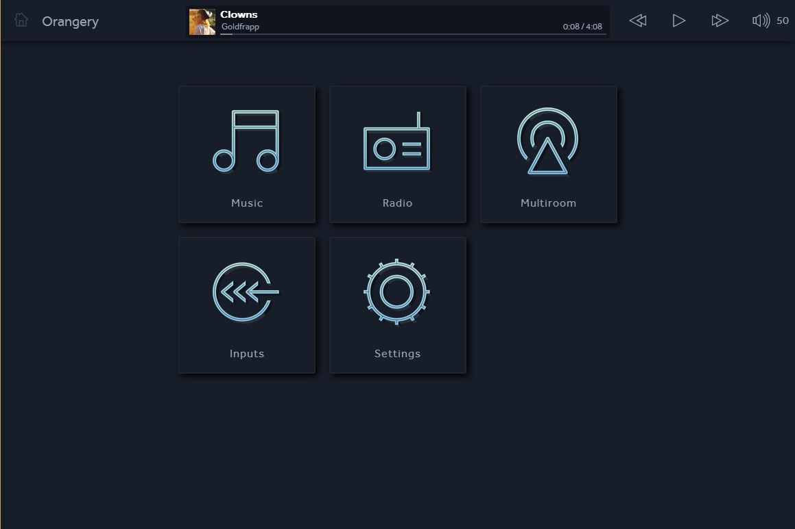
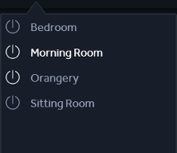
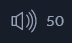
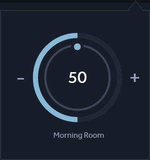
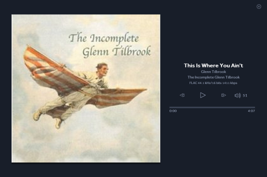
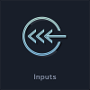
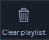
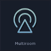

# Kazoo User Guide

## Overview

Kazoo provides simple and intuative way to play music all around your home.

Kazoo has been designed to control Linn DS systems and Kazoo Server. Kazoo will also work with 3rd party UPnP/AV media servers, but for the best music experience, we recommend using Kazoo with Kazoo Server.

Kazoo is available for iPad (iOS 6.0 and later), Windows (Windows XP SP3 and later) and Mac (Lion and later).

## Operation

Kazoo has support for homes that have multiple DS systems. Each system in the home should be given a unique room name. A system's room name can be configured using Linn Konfig.

### Navigation

Selects a room to play music in.

1. To show the room selection dialog click 
2. Click on the desired room name 

* The currently selected room is highlighted in white
* When moving between rooms the music will continue to play
* Rooms in standby will have their standby button greyed out
* To turn all systems off click 

To return to the homescreen click 

To open the volume control dialog (if available) click 

To open the fullscreen view click 

To view a room's permanent subzones and whether they are enabled click 

### Playback controls

Provides the playback controls, play/pause/stop, skip forwards and skip backwards for the selected room.

### Volume controls

Provides volume controls for the selected room.

1. Click and rotate clockwise on the dial to turn the volume up; Alternatively click on the + button
2. Click and rotate anti-clockwise on the dial to turn the volume down; Alternatively click on the - button
3. Click on the centre of the dial to toggle mute

* If rooms are grouped the Master volume will affect all rooms
* The inner number shows the absolute volume value
* The outer dial shows the percentage that the current volume is of the volume limited volume

### Now Playing and Fullscreen view

The now playing and fullscreen view provide information about the currently playing audio.

## Music sources

### Local music library

Linn DS systems can play music from computers and network attached storage (NAS) units on your home network through an additional piece of software, [Kazoo Server](http://oss.linn.co.uk/trac/wiki/KazooServerManual).

To select music from your local music library click 

* Organisation of music depends on the quality of the information contained in the music tracks
* To view music stored in a different library on your home network go to settings and select 

### Radio

Linn DS systems can play internet radio through radio presets. To access a room's radio presets click 

Linn DS systems come with a variety of preselected regional stations which can be configured using Linn Konfig.

### External inputs

Linn DS systems can play audo from external sources. To listen to an external source select the tile with the source's name from the homepage.

Source name can be configured using Linn Konfig.

* Visible sources that are still using the factory default name can be found by clicking 
* If a source is not being used we recommend removing it from the UI by setting its Visibility to false

## Searching

Search can be used to look for music within  when using KazooServer.

Click  and enter the desired, partial or full, search term.

As you enter the search term, matching results will being to appear.

* Search results are grouped into categories, Albums, Artists, Classical and Tracks
* The number of results for each category are shown in brackets after the category label
* Albums shows albums who's title contains the search term
* Artists shows artists who's name contains the search term
* Classical shows composers who's name contains the search term
* Tracks show tracks where any piece of track information contains the search term

## Managing the playlist

A typical user will not need to manipulate the playlist as queue music will take care of itself, playing in the order selected by the user.

To view the playlist click 

### Clearing the playlist

1. Click 
2. Click 
3. Click 

All tracks will be removed from the currently selected room's playlist.

### Shuffle and Repeat

Shuffle and Repeat controls can be found in the playlist dialog

To play tracks in the playlist in a random order click 
*Shuffle turns white when enabled*

To repeat the playlist after the last track has played click 
*Repeat turns white when enabled*

## Dynamic grouping of rooms

Linn DS systems provides the ability to different play music in every room in the house, play the same music in all rooms or play the same music in a subset of rooms.

All rooms grouped together play the same music in perfect synchronisation.

1. Click 
2. Click  on the room you want to group with other rooms
3. Check the rooms you want to add to the group

* You can choose to either select and play the music you want and then group additional rooms or group rooms then select and play music
* Rooms added to a group will immediately start playing music in perfect synchronisation

## Permanent grouping of rooms

A permanent subzone is a room that plays the same music as another room but does not appear as a selectable room. An example of this behaviour is a dressing room connected to a bedroom. In most situations a listener would want both rooms to play the same music but be able to control the volume in each room independently.

To make a room a permanently part of a group you need to configure your Linn system using Konfig. To add a room to as a permanent member of a group you must configure the name of the room's Receiver source, (it's default name is Songcast), to be that of the group.

In our example of a bedroom, called "Bedroom", with a dressing room, called "Dressing Room", you would configure the name of the dressing room's Receiver source to "Bedroom".

* If a permanently grouped room is not playing the same as the group click  and ensure the room is ticked
* The permanent grouped icon will only be visible if there is a permanently grouped room associated with the currently selected room
* Rooms that are permanently grouped do not appear as an selectable room

